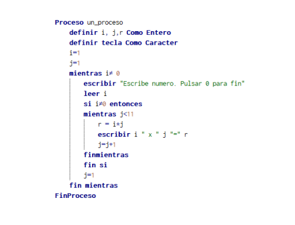

# Recuperacion Eloy - Miguel Cordero González

# Índice

1. [Programación Python](#Programación-Python)
    * [Código 1](#Descripción-de-lo-que-hace-el-algoritmo-1)
    * [Código 2](#Descripción-de-lo-que-hace-el-algoritmo-2)
    * [Código 3](#Descripción-de-lo-que-hace-el-algoritmo-3)
2. [Desarrollo de algoritmos en Python](Desarrollo-de-algoritmos-en-Python)
   * [Enunciado 1](#Enunciado-1)
   * [Enunciado 2](#Enunciado-2)
   * [Enunciado 3](#Enunciado-3)
   * [Enunciado 4](#Enunciado-4)
   * [Enunciado 5](#Enunciado-5)
3. [Linux](#lINUX)
4. [Comandos Linux](#Comandos-LINUX)
   * [Ejercicio1](#Ejercicio-1)
   * [Ejercicio2](#Ejercicio-2)
   * [Ejercicio3](#Ejercicio-3)
5. [Windows](#Windows)
6. [Gestión de recursos y otros](#Gestión-de-recursos-y-otros)
7. [Virtualización](#Virtualización)
   * [VIDEO](#Enlace-al-video)
8. [Red NAT](#Red-NAT)
   * [VIDEO](#Enlace-al-video-2)


# Programación Python

### Descripción de lo que hace el algoritmo 1

El programa solicitara tres números al usuario, determina cuál es el mayor de ellos y luego pregunta si el usuario desea finalizar el proceso. Este bucle se repite hasta que el usuario ingresa 0 para finalizar el programa.

Código1


### Descripción de lo que hace el algoritmo 2

El programa solicitara al usuario si desea ejecutarse, y si la respuesta es "s", solicita 10 números al usuario, determina si cada número es par o impar, y finalmente imprime un mensaje indicando si el número fue seleccionado o no, junto con el resto de la división por 2.

Código2


### Descripción de lo que hace el algoritmo 3

El programa solicitara al usuario que ingrese un número y luego imprime la tabla de multiplicar correspondiente a ese número hasta el 10. El proceso se repite hasta que el usuario ingresa 0.

Código3



# Desarrollo de algoritmos en Python

### Enunciado 1
Desarrolla un algoritmo que pida al usuario las calificaciones de 5 módulos de un alumno.
El algoritmo mostrará en pantalla la calificación mayor, la calificación menor, y la media de
las calificaciones.

```
Proceso CalificacionesAlumno
    // Definir variables
    Definir calificacion, suma, maxima, minima Como Real
    suma = 0

    // Inicializar valores de máxima y mínima con valores extremos
    maxima = -1
    minima = 101

    // Solicitar calificaciones al usuario
    Para i = 1 Hasta 5 Hacer
        Escribir "Ingrese la calificación del módulo ", i, ": "
        Leer calificacion

        // Validar que la calificación esté en el rango [0, 100]
        Mientras calificacion < 0 o calificacion > 100 Hacer
            Escribir "La calificación debe estar en el rango de 0 a 100. Intente nuevamente: "
            Leer calificacion
        Fin Mientras

        // Actualizar suma
        suma = suma + calificacion

        // Actualizar máxima y mínima
        Si calificacion > maxima Entonces
            maxima = calificacion
        Fin Si

        Si calificacion < minima Entonces
            minima = calificacion
        Fin Si
    Fin Para

    // Calcular media
    media = suma / 5

    // Mostrar resultados
    Escribir "La calificación mayor es: ", maxima
    Escribir "La calificación menor es: ", minima
    Escribir "La media de las calificaciones es: ", media
Fin Proceso
```

### Enunciado 2
Escribe un algoritmo que, dado un número introducido por el usuario, indique si el número
es capicua o no.

```
Proceso VerificarCapicua
    // Definir variables
    Definir numero, original, invertido Como Entero
    Definir esCapicua Como Booleano

    // Solicitar al usuario que ingrese un número
    Escribir "Ingrese un número: "
    Leer numero

    // Almacenar el número original antes de invertirlo
    original = numero

    // Inicializar el número invertido
    invertido = 0

    // Invertir el número
    Mientras numero > 0 Hacer
        invertido = invertido * 10 + (numero MOD 10)
        numero = numero / 10
    Fin Mientras

    // Verificar si el número original es igual al invertido
    Si original = invertido Entonces
        esCapicua = Verdadero
    Sino
        esCapicua = Falso
    Fin Si

    // Mostrar el resultado
    Si esCapicua Entonces
        Escribir "El número ingresado es capicúa."
    Sino
        Escribir "El número ingresado no es capicúa."
    Fin Si
Fin Proceso
```

### Enunciado 3
Implementa un algoritmo que busque el nombre de una ciudad entre un conjunto de diez ciudades
predefinidas. Al inicio se creará el conjunto con el nombre de las diez ciudades. Posteriormente se pedirá el nombre de una ciudad al usuario. El programa indicará si la ciudad se encuentra en el conjunto o no. Deberá dar por válidas entradas en minúsculas, mayúsculas. Por ejemplo, Si tenemos almacenada “Mérida”, se dará por válido “mérida”, “Mérida”, “MÉRIDA”, “MériDa”, etc.

```
Proceso BuscarCiudad
    // Definir el conjunto de diez ciudades predefinidas
    Definir ciudades[10] Como Caracter
    ciudades[1] = "Mérida"
    ciudades[2] = "Barcelona"
    ciudades[3] = "Madrid"
    ciudades[4] = "Londres"
    ciudades[5] = "París"
    ciudades[6] = "Nueva York"
    ciudades[7] = "Roma"
    ciudades[8] = "Sídney"
    ciudades[9] = "Tokio"
    ciudades[10] = "Berlín"

    // Solicitar al usuario que ingrese el nombre de una ciudad
    Escribir "Ingrese el nombre de una ciudad: "
    Leer ciudad_ingresada

    // Convertir la ciudad ingresada a minúsculas para hacer la comparación
    ciudad_ingresada = ConvertirAMinúsculas(ciudad_ingresada)

    // Buscar la ciudad en el conjunto
    Encontrada = Falso
    Para i = 1 Hasta 10 Hacer
        // Convertir la ciudad actual a minúsculas para la comparación
        ciudad_actual = ConvertirAMinúsculas(ciudades[i])

        Si ciudad_actual = ciudad_ingresada Entonces
            Encontrada = Verdadero
            Romper // Salir del bucle si la ciudad se encuentra
        Fin Si
    Fin Para

    // Mostrar el resultado
    Si Encontrada Entonces
        Escribir "La ciudad se encuentra en el conjunto."
    Sino
        Escribir "La ciudad no se encuentra en el conjunto."
    Fin Si
Fin Proceso

Proceso ConvertirAMinúsculas(caracter)
    // Función auxiliar para convertir un string a minúsculas
    // Puedes utilizar funciones proporcionadas por el lenguaje de programación específico
    // o implementar tu propia lógica para convertir a minúsculas.
    // La implementación específica dependerá del lenguaje que estés utilizando.
Fin Proceso
```

### Enunciado 4
Desarrolla un programa que pida al usuario un número del 1 al 50 y que muestre la representación de dicho número en binario, octal y hexadecimal.

```
Proceso MostrarRepresentaciones
    // Definir variables
    Definir numero, binario, octal, hexadecimal Como Entero

    // Solicitar al usuario un número del 1 al 50
    Mientras Verdadero
        Escribir "Ingrese un número del 1 al 50: "
        Leer numero

        Si numero >= 1 y numero <= 50 Entonces
            Salir del Mientras
        Fin Si

        Escribir "El número debe estar en el rango del 1 al 50. Intente nuevamente."
    Fin Mientras

    // Calcular representaciones binaria, octal y hexadecimal
    binario <- ConvertirABinario(numero)
    octal <- ConvertirAOctal(numero)
    hexadecimal <- ConvertirAHexadecimal(numero)

    // Mostrar resultados
    Escribir "Representación binaria: ", binario
    Escribir "Representación octal: ", octal
    Escribir "Representación hexadecimal: ", hexadecimal

Fin Proceso

Proceso ConvertirABinario(numero)
    // Función para convertir a representación binaria
    Cadena binario
    binario <- ""
    
    Mientras numero > 0 Hacer
        binario <- (numero MOD 2) Concatenar binario
        numero <- numero / 2
    Fin Mientras
    
    Devolver binario
Fin Proceso

Proceso ConvertirAOctal(numero)
    // Función para convertir a representación octal
    Cadena octal
    octal <- ""
    
    Mientras numero > 0 Hacer
        octal <- (numero MOD 8) Concatenar octal
        numero <- numero / 8
    Fin Mientras
    
    Devolver octal
Fin Proceso

Proceso ConvertirAHexadecimal(numero)
    // Función para convertir a representación hexadecimal
    Cadena hexadecimal
    hexadecimal <- ""
    
    Mientras numero > 0 Hacer
        Resto <- numero MOD 16
        Si Resto < 10 Entonces
            hexadecimal <- Resto Concatenar hexadecimal
        Sino
            hexadecimal <- ConvertirAHexadecimalLetra(Resto) Concatenar hexadecimal
        Fin Si
        numero <- numero / 16
    Fin Mientras
    
    Devolver hexadecimal
Fin Proceso

Proceso ConvertirAHexadecimalLetra(valor)
    // Función auxiliar para convertir a letra en representación hexadecimal
    Caracter letrasHexadecimales[6]
    letrasHexadecimales[10] <- "A"
    letrasHexadecimales[11] <- "B"
    letrasHexadecimales[12] <- "C"
    letrasHexadecimales[13] <- "D"
    letrasHexadecimales[14] <- "E"
    letrasHexadecimales[15] <- "F"

    Devolver letrasHexadecimales[valor]
Fin Proceso

// Llamar al proceso para ejecutar el programa
MostrarRepresentaciones()
```

### Enunciado 5
Implementa un programa que pida al usuario una cantidad de dinero hasta que dicha cantidad sea
múltiplo de 5 y, como máximo 3000. Una vez que se cumplan estas condiciones se tiene que
mostrar al usuario el número de billetes de 100, 50, 20, 10 y 5 que se necesitan para obtener la cantidad de dinero indicada.

```
Proceso DesgloseBilletes
    // Definir variables
    Definir cantidad, billetes_100, billetes_50, billetes_20, billetes_10, billetes_5 Como Entero

    // Solicitar al usuario una cantidad de dinero
    Mientras Verdadero
        Escribir "Ingrese una cantidad de dinero (máximo 3000, múltiplo de 5): "
        Leer cantidad

        Si cantidad > 0 y cantidad <= 3000 y (cantidad MOD 5 = 0) Entonces
            Salir del Mientras // Salir del bucle si la cantidad es válida
        Fin Si

        Escribir "La cantidad debe ser un múltiplo de 5 y no puede superar los 3000."
    Fin Mientras

    // Inicializar variables para contar billetes
    billetes_100 <- 0
    billetes_50 <- 0
    billetes_20 <- 0
    billetes_10 <- 0
    billetes_5 <- 0

    // Desglose de billetes
    Mientras cantidad >= 100 Hacer
        billetes_100 <- billetes_100 + 1
        cantidad <- cantidad - 100
    Fin Mientras

    Mientras cantidad >= 50 Hacer
        billetes_50 <- billetes_50 + 1
        cantidad <- cantidad - 50
    Fin Mientras

    Mientras cantidad >= 20 Hacer
        billetes_20 <- billetes_20 + 1
        cantidad <- cantidad - 20
    Fin Mientras

    Mientras cantidad >= 10 Hacer
        billetes_10 <- billetes_10 + 1
        cantidad <- cantidad - 10
    Fin Mientras

    Mientras cantidad >= 5 Hacer
        billetes_5 <- billetes_5 + 1
        cantidad <- cantidad - 5
    Fin Mientras

    // Mostrar resultados
    Escribir "Billetes de 100:", billetes_100
    Escribir "Billetes de 50:", billetes_50
    Escribir "Billetes de 20:", billetes_20
    Escribir "Billetes de 10:", billetes_10
    Escribir "Billetes de 5:", billetes_5
Fin Proceso

// Llamar al proceso para ejecutar el programa
DesgloseBilletes()
```
# LINUX
### Supuesto práctico usuarios, grupos y permisos

Escribe todas las órdenes necesarias para dar solución al siguiente supuesto:
- Se va a utilizar un servidor para que los componentes de una empresa (compuesta por 4 empleados y 2 jefes) pueda acceder diferentes sitios del servidor.
- Los empleados de la empresa pueden acceder con total libertad a su carpeta de trabajo y a la carpeta (/home/paracompartirempl).
- Los jefes pueden acceder con total libertad a su carpeta de trabajo y a la carpeta compartida (/home/paracompartirjefes).
- Los empleados no pueden acceder a las carpetas de trabajo de los jefes, tampoco a la carpeta compartida de los jefes.
- Los jefes pueden acceder y visualizar el contenido del directorio “paracompartirempl”, pero no pueden alterar su contenido.

Realiza todo lo necesario para resolver la cuestión anterior siendo tu maquina el servidor.
Las operaciones y el orden en que se deben realizar es importante: crear usuarios, crear grupos,
añadir usuarios a grupos, crear directorios, cambiar grupos de los directorios, etc.
Crea otro usuario que se llame “fernando” y que no pertenezca a ningún grupo. Comprueba que se
trata de un usuario y que con dicho usuario no es posible acceder a ninguna de las carpetas
compartidas.


# Comandos LINUX

### Ejercicio 1

Indica las instrucciones necesarias para mostrar en la pantalla, en el formato indicado, la siguiente
información de tu usuario:
Nombre de usuario: xxx
Id de usuario: xxx
Id de grupo: xxx
Ruta de su directorio personal: xxx

```
echo "Nombre de usuario: $(whoami)"
echo "Id de usuario: $(id -u)"
echo "Id de grupo: $(id -g)"
echo "Ruta de su directorio personal: $HOME"
```

### Ejercicio 2

Escribe los comandos necesarios para crear y borrar un usuario. Debes explicar cada comando.
El usuario tendrá su directorio personal en una ruta diferente a la habitual. Este directorio personal se creará a la vez que se crea el usuario. También se añadirá su nombre y apellidos en el momento de la creación, así como una fecha de caducidad de la cuenta.

```
sudo useradd -m -d /ruta/del/nuevo/directorio -c "Nombre Apellido" -e YYYY-MM-DD nombre_usuario
```
+ sudo: Ejecuta el comando con privilegios de administrador.
+ useradd: Comando para agregar un nuevo usuario.
+ -m: Crea el directorio personal del usuario en la ruta especificada con la opción -d.
+ -d /ruta/del/nuevo/directorio: Especifica la ruta del directorio personal del nuevo usuario.
+ -c "Nombre Apellido": Añade el nombre y apellido del usuario como comentario.
+ -e YYYY-MM-DD: Establece una fecha de caducidad para la cuenta del usuario (en el formato Año-Mes-Día).
+ nombre_usuario: El nombre de usuario que deseas crear.

```
sudo userdel -r nombre_usuario
```

+ sudo: Ejecuta el comando con privilegios de administrador.
+ userdel: Comando para eliminar un usuario.
+ -r: Elimina también el directorio personal y los archivos asociados al usuario.
+ nombre_usuario: El nombre de usuario que deseas eliminar.

### Ejercicio 3

• Crear un directorio dentro de Documentos llamado ejercicio_permisos
• Dentro del directorio crear 9 archivos (archiv1,archiv2,etc.)

```
mkdir ~/Documentos/ejercicio_permisos
cd ~/Documentos/ejercicio_permisos

touch archiv1 archiv2 archiv3 archiv4 archiv5 archiv6 archiv7 archiv8 archiv9
```

• Establecer a cada archivo los siguientes permisos:

+ archiv1 -rwx------
+ archiv2 -rw-------
+ archiv3 -rwxrwxrwx
+ archiv4 -rwxrw-r--
+ archiv5 -rwxr-----
+ archiv6 -r-xrw-r--
+ archiv7 -r-------x
+ archiv8 -rw-r—r--
+ archiv9 -rw-rw-r—

```
chmod 700 archiv1
chmod 600 archiv2
chmod 777 archiv3
chmod 764 archiv4
chmod 711 archiv5
chmod 613 archiv6
chmod 400 archiv7
chmod 644 archiv8
chmod 664 archiv9
```

• Añade y/o retira permisos sobre los archivos anteriores utilizando los operadores + y - del
'chmod' para que queden de la siguiente manera:

+ archiv1 -rwx---r--
+ archiv2 -r--------
+ archiv3 -rw-rw-rwarchiv4
+ -rwx-w----
+ archiv5 -rwx----wx
+ archiv6 -rwxrw----
+ archiv7 -rw---x-w
+ archiv8-------r--
+ archiv9 -rwx------

```
chmod +x archiv1
chmod -r archiv2
chmod 666 archiv3
chmod +w,--x archiv4
chmod +wx----wx archiv5
chmod +wxrw---- archiv6
chmod -w+x-w archiv7
chmod ----r-- archiv8
chmod +rwx------ archiv9
```

• Crear un directorio y quitarle todos los permisos de ejecución.

```
mkdir directorio_prueba
chmod 000 directorio_prueba
```

◦ Explicar qué pasa al intentar entrar al directorio con el comando cd.
◦ Explicar el significado de los permisos r,w y x para directorios.

+ Al intentar entrar al directorio con el comando cd, recibirás un mensaje de error indicando que no tienes permisos para acceder al directorio.
+ Los permisos para directorios tienen los siguientes significados:
r (Read): Permite ver el contenido del directorio.
w (Write): Permite crear, borrar o renombrar archivos en el directorio.
x (Execute): Permite entrar y acceder al contenido del directorio.


# Windows
Supuesto práctico

Crea la siguiente estructura departamental trasladándola a carpetas, es decir, crea una carpeta por cada
departamento.
Crea primero la carpeta 'empresaMaderArt' y dentro de ésta las demás. Introduce algunos archivos,
documentos, imágenes en cada carpeta. Sitúa la estructura de carpetas colgando directamente de una
unidad de disco.


Después crea 2 usuarios para cada departamento (usuarios con privilegios limitados). Los usuarios
aparecen al final de la tarea.

Nómbralos, con la inicial del nombre y el primer apellido (por ejemplo: Ignacio Díaz sería idiaz). Guarda en la descripción de cada usuario el nombre y apellido completos. Crea un grupo de usuarios para cada departamento e incluye los dos usuarios en él. Un usuario sólo podrá pertenecer a un grupo únicamente.

Configura los permisos de cada carpeta para que los grupos de usuarios de cada departamento tengan permisos de lectura y escritura sobre su carpeta del departamento. El resto de usuarios no tendrá acceso a carpetas de otros departamentos distintos del suyo.

Inicia sesión con diferentes usuarios y comprueba que los permisos sobre las carpetas son correctos y que un usuario de un departamento sólo puede acceder a la carpeta común de su departamento. Intenta acceder a otras carpetas a las que el usuario no debería tener acceso.

Inicia sesión con un usuario del primer departamento. En la carpeta del departamento cifra uno de los documentos que hay dentro. Haz una copia de seguridad del certificado de cifrado con la contraseña 123. Intenta entrar con el otro usuario del departamento y acceder al archivo cifrado e indica qué ocurre.

Habilita las directivas de contraseña correspondientes para que el sistema guarde registro de las 4 últimas contraseñas de usuario, éstas deben ser complejas, tener una vigencia máxima de 1 mes, una longitud mínima de 10 caracteres y que permita hasta 3 equivocaciones del usuario al iniciar sesión.

Usuarios:
+ Fernando Cortés
+ Marina Céspedes
+ Salvador Jiménez
+ Martín Rodríguez
+ Luisa Serrano
+ Rosa Valle
+ Dolores Huertas
+ Estefanía Pérez
+ Ignacio Díaz
+ Arancha Benavente


# Gestión de recursos y otros

Comandos para la gestión de procesos y memoria

Desarrolla un listado de comandos en LINUX. Debes indicar para cada comando una descripción, así como un ejemplo de ejecución (captura de pantalla).

Licencias 1

Realiza un estudio de como puede ser el software comercial en función de las licencias de
distribución: OEM, Retail y Licencias por volumen. Explica con tus propias palabras en qué
consiste cada una de estas licencias y expón un ejemplo práctico de cada una de ellas.

Las licencias de distribución en el software comercial son esenciales para definir cómo se pueden adquirir, distribuir y utilizar los productos. Tres tipos comunes de licencias son OEM (Original Equipment Manufacturer), Retail y Licencias por Volumen.

OEM (Original Equipment Manufacturer):
Estas licencias están diseñadas para ser incluidas con hardware específico.
Retail (venta al por menor):
Las licencias retail se venden directamente al consumidor final a través de minoristas.
Licencias por Volumen:
Diseñadas para organizaciones que necesitan implementar el software en múltiples máquinas.

Licencias 2

Investiga acerca de las licencias “Creative Commons”. Explica en qué consiste cada una de ellas y expón un ejemplo de creación de una licencia concreta (capturas de pantalla).

Las licencias Creative Commons son un conjunto de licencias de derechos de autor que permiten a los creadores de contenido especificar los permisos que otorgan a otros con respecto a su obra.

Atribución (CC BY):
Esta licencia permite a otros copiar, distribuir, mostrar y realizar la obra y las obras derivadas, incluso con fines comerciales, siempre y cuando se dé crédito al autor original de la manera especificada por estos.

Atribución-CompartirIgual (CC BY-SA):
Esta licencia permite a otros remixar, retocar, y crear a partir de la obra, incluso con fines comerciales, siempre y cuando otorguen la misma licencia a las obras derivadas.

Atribución-NoComercial (CC BY-NC):
Esta licencia permite a otros copiar, distribuir, mostrar y realizar la obra y las obras derivadas, pero solo para fines no comerciales.

Atribución-NoComercial-CompartirIgual (CC BY-NC-SA):
Esta licencia permite a otros remixar, retocar, y crear a partir de la obra, incluso con fines comerciales, siempre y cuando otorguen la misma licencia a las obras derivadas y no las utilicen con fines comerciales.

Atribución-NoComercial-SinDerivadas (CC BY-NC-ND):
Esta licencia es la más restrictiva de las seis licencias principales, solo permite descargar las obras y compartirlas con otras personas siempre que se dé crédito, pero no se pueden cambiar de ninguna manera ni se pueden utilizar comercialmente.


Recuperar eloy tiene licencia CC BY-NC-SA 4.0.© 2 por m 

# Virtualización

### Enlace al video

- https://youtu.be/RV0ZHygoS5Y

Instalación dual

Crea una máquina virtual de arquitectura de 64bits, memoria principal de 2GB y 80GB de disco
duro.

En dicha máquina instalarás dos sistemas operativos, Windows 7 y Xubuntu 16.04, de forma que al
iniciar la máquina se nos de la opción de elegir qué sistema queremos arrancar.

El disco duro quedará particionado de la siguiente forma:
+ 1 partición NTFS de 20GB para instalar Windows7.
+ 1 partición FAT32 de 10GB para datos de Windows7.
+ 1 partición EXT4 para /boot de 512MB.
+ 1 partición EXT4 de 20GB para “/”.
+ 1 partición EXT4 de 4GB para swap.
+ 1 partición EXT4 del resto de capacidad para “/home”

En el vídeo se tiene que mostrar todo el proceso de creación y configuración de la máquina, siendo imprescindible mostrar cómo queda finalmente el particionado del disco, así como el arranque dual del sistema.

# Red NAT

### Enlace al video 2

- https://youtu.be/5xy6GP_18Jw

Crea otra máquina virtual con el sistema operativo que desees.
Crea una red NAT en la que estén conectadas ambas máquinas, la creada en la “instalación dual” y la que acabas de crear.
Tienes que mostrar, mediante capturas de pantalla, el proceso de creación de la red, así como las pruebas que permiten comprobar que ambas máquinas se encuentran en la misma red.

Primero creamos la red nat que vamos a asociar a las maquina virtuales ya creadas


Luego nos vamos a la configuracion de la maquina > red > adaptador 1. Y selecionamos la red nat que hamos creado


Luego iniciamos las dos maquina y comprobamos que nos asocia una direccion ip mediante dchp


Y ya por ultimos probamos que estan en la misma red mediante un ping


